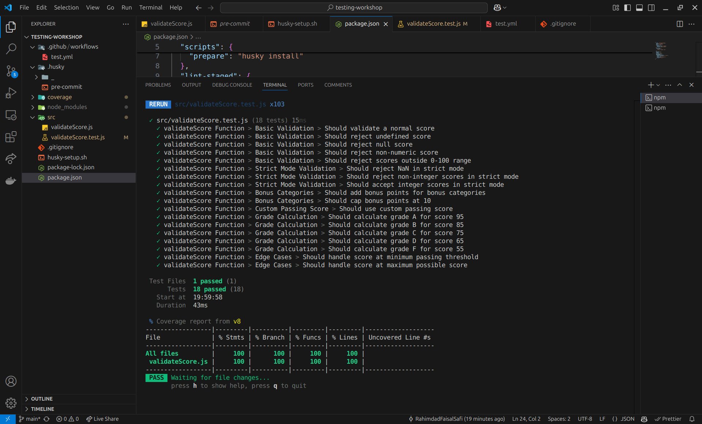
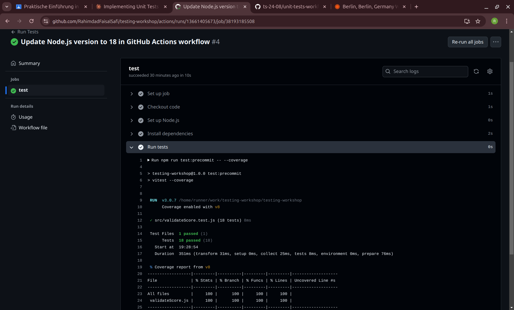

# TESTING.md

## Test Coverage Report

## Discovered Bugs or Edge Cases

1. **Undefined Score**: The function `validateScore` should reject an undefined score and return an error message "Score ist erforderlich".
2. **Non-numeric Score**: The function should reject non-numeric scores and return an error message "Score muss eine Zahl sein".
3. **Scores Outside 0-100 Range**: The function should reject scores outside the 0-100 range and return an error message "Score muss zwischen 0 und 100 liegen".

## Test Structure

The tests are structured into several categories:
- **Basic Validation**: Tests for normal and invalid scores.
- **Strict Mode Validation**: Tests for strict mode where only integer scores are accepted.
- **Bonus Categories**: Tests for adding bonus points.
- **Custom Passing Score**: Tests for custom passing score thresholds.
- **Grade Calculation**: Tests for calculating grades based on scores.
- **Edge Cases**: Tests for edge cases like minimum passing threshold and maximum possible score.

## Reflection on TDD Approach

### Advantages
- **Improved Code Quality**: Writing tests first ensures that the code meets the requirements and handles edge cases.
- **Early Bug Detection**: Bugs are detected early in the development process, reducing the cost of fixing them later.
- **Better Design**: TDD encourages writing modular and testable code, leading to better software design.

### Disadvantages
- **Time-Consuming**: Writing tests before the actual code can be time-consuming, especially for complex features.
- **Initial Learning Curve**: Developers new to TDD may find it challenging to adopt the approach initially.

## Successful GitHub Action

